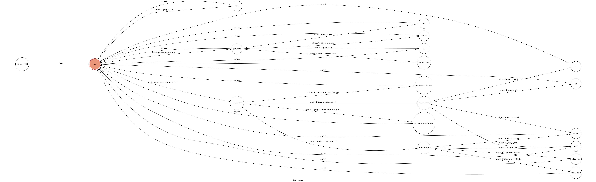
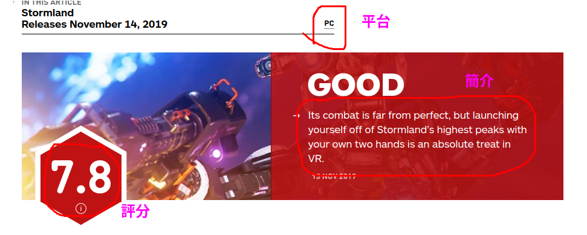

# TOC Project 2020

[](https://codeclimate.com/github/NCKU-CCS/TOC-Project-2020/maintainability)

[](https://snyk.io/test/github/NCKU-CCS/TOC-Project-2020)

發送隨機一篇遊戲新聞（根據遊戲評論網站IGN）
或者是以我的觀點幫你選擇遊戲（根據遊戲類型和平台）
## Setup

### Prerequisite
* Python 3.6
* Pipenv
* Facebook Page and App
* HTTPS Server

#### Install Dependency
```sh
pip3 install pipenv

pipenv --three

pipenv install

pipenv shell
```

* pygraphviz (For visualizing Finite State Machine)
    * [Setup pygraphviz on Ubuntu](http://www.jianshu.com/p/a3da7ecc5303)
	* [Note: macOS Install error](https://github.com/pygraphviz/pygraphviz/issues/100)

#### Run Locally
You can either setup https server or using `ngrok` as a proxy.

#### a. Ngrok installation
* [ macOS, Windows, Linux](https://ngrok.com/download)

or you can use Homebrew (MAC)
```sh
brew cask install ngrok
```

**`ngrok` would be used in the following instruction**

```sh
ngrok http 8000
```

After that, `ngrok` would generate a https URL.

#### Run the sever

```sh
python3 app.py
```
## Finite State Machine


## Usage
### game news
1. 輸入game news後會有選項讓使用者選擇想要知道的遊戲新聞的平台

2. 選擇之後則會隨機挑選一則近期的遊戲新聞網址還有簡短說明跟評分以及可遊玩的平台。

### recommend
1. 輸入recommend後會有選項讓使用者選擇希望推薦的遊戲的平台

2. 選擇平台後會有選項讓使用者選擇希望推薦的遊戲類型

3. 選完後，我會推薦一款我認為在這個平台跟遊戲類型下值得玩的一款遊戲。

### show-fsm
1. 輸入draw則會顯示當前的FSM的狀態圖


## Scraping mechanism
- 遊戲新聞的資料（評分跟評語）是擷取自IGN的遊戲新聞
- https://www.ign.com/{遊戲平台} 會顯示此遊戲平台的遊戲新聞
- 隨機選取一則新聞之後進到新聞頁面中，並拿出需要的資訊。

